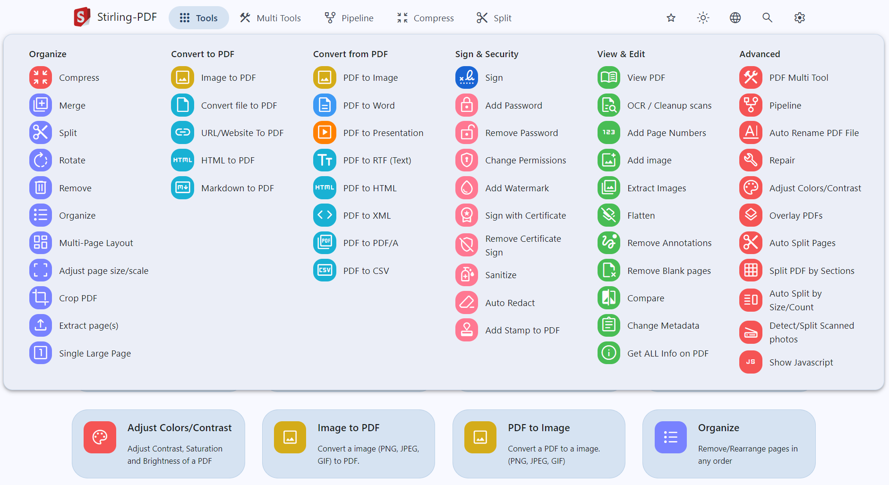

# Stirling-PDF CI/CD pipeline

Deploy Stirling-PDF server with CI/CD on Elestio

 
 

# Once deployed ...

You can open Stirling-PDF here:

    URL: https://[CI_CD_DOMAIN]
    login: "admin"
    password: "[ADMIN_PASSWORD]"

# API

## Accessing API Documentation

1.  Ensure you are logged in to your account on https://[CI_CD_DOMAIN].
2.  Once logged in, you can access the API documentation by visiting the following link:

        https://[CI_CD_DOMAIN]/swagger-ui/index.html

## Optional Authorization Setup

While authorization is not mandatory, you have the option to set it up using an API key. Follow these steps if you choose to add authorization:

1.  `Generate API Key`: If you decide to add authorization, go to the following link to generate your API key:

        https://[CI_CD_DOMAIN]/account

2.  `Copy API Key`: After generating the API key, copy it to your clipboard.

3.  `Authorize` : Navigate back to the API documentation link: https://[CI_CD_DOMAIN]/swagger-ui/index.html.

4.  `Click on Authorize Button` : In the API documentation page, you may choose to click on the "Authorize" button.

5.  `Paste API Key` : If you clicked on "Authorize", a popup will appear for authorization. Paste the API key you copied earlier into the designated field.

6.  `Confirm` : After pasting the API key, confirm and proceed. You are now authorized to access the API using your generated key.
