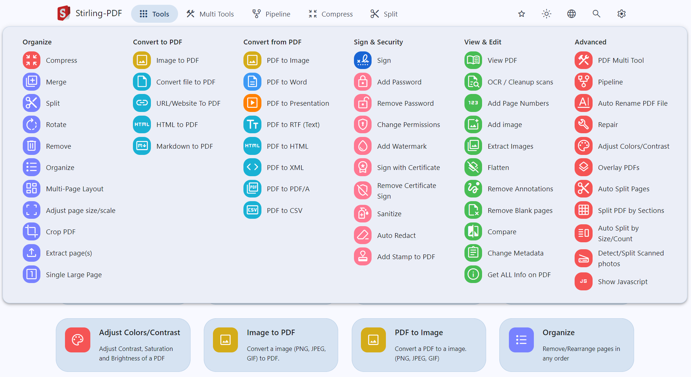

# Stirling-PDF CI/CD pipeline

Deploy Stirling-PDF server with CI/CD on Elestio

 
 

# Once deployed ...

You can open Stirling-PDF here:

    URL: https://[CI_CD_DOMAIN]
    login: "admin"
    password: "[ADMIN_PASSWORD]"
